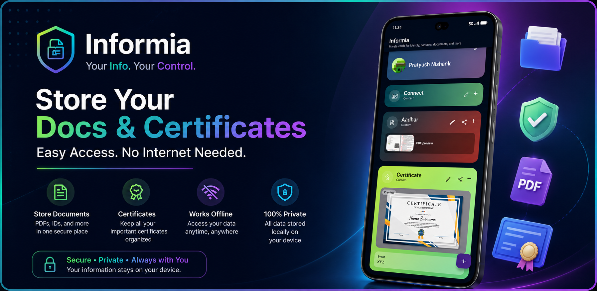
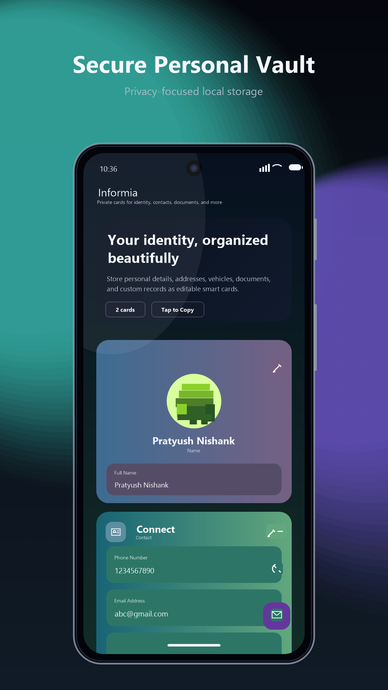
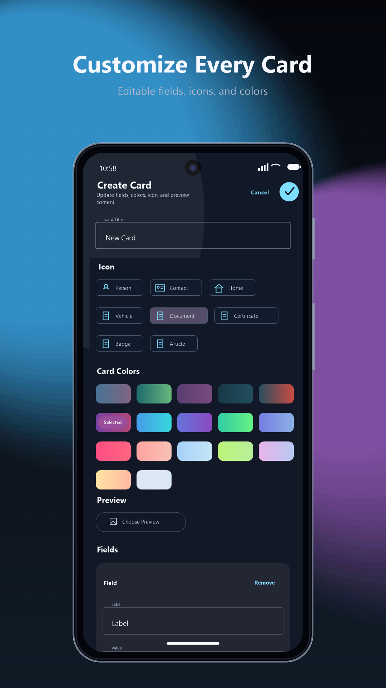
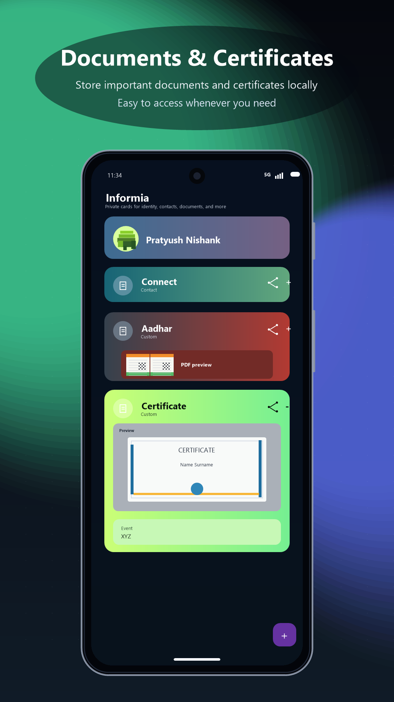

# 📁 Informia

<p align="center">
  
</p>

<p align="center">
  A modern personal document vault built with <b>Kotlin</b> and <b>Jetpack Compose</b>.
</p>

---

## ✨ Features

- 📂 Store and organize important files
- 🔐 Personal vault-style experience
- 🖼️ Clean modern UI with Material Design 3
- 📎 Attachment management system
- ⚡ Smooth Jetpack Compose interface
- 📱 Optimized Android experience
- 🌙 Dark mode friendly design

---

## 📸 Screenshots

<p align="center">
  
  
  
</p>

---

## 🛠️ Tech Stack

- **Kotlin**
- **Jetpack Compose**
- **Material 3**
- **Android SDK**
- **MVVM Architecture**

---

## 🚀 Getting Started

### Clone the repository

```bash
git clone https://github.com/pratyush-deve/Informia-App.git

Open in Android Studio
Open Android Studio
Click Open
Select the project folder
Sync Gradle
Run the app 🚀

📂 Project Structure
app/
 ├── src/main/java/com/pratyush/infoapp
 ├── ui/
 ├── vault/
 ├── editor/
 ├── assets/playstore/

👨‍💻 Developer

Made with ❤️ by Pratyush Nishank

GitHub: @pratyush-deve
